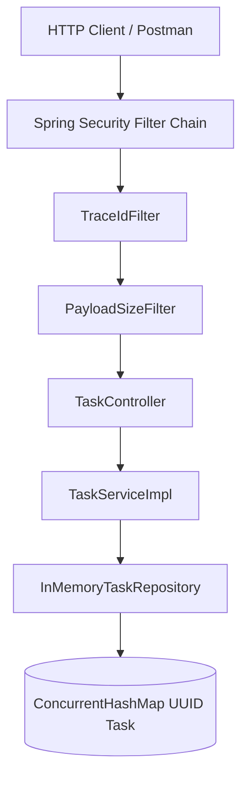
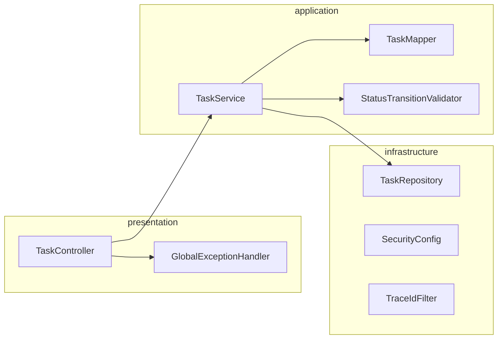
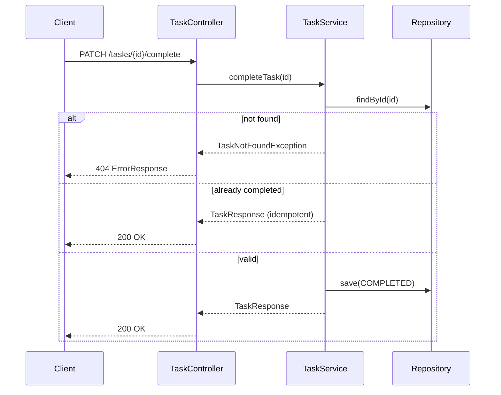
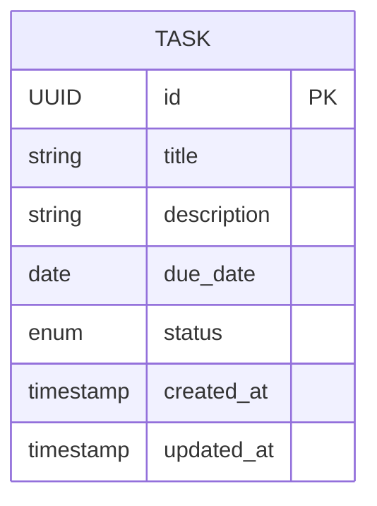

# Task Manager API — Architecture Documentation

## Requirements Analysis

### Explicit Requirements

| ID | Requirement |
|----|-------------|
| R1 | CRUD REST API for tasks |
| R2 | PATCH endpoint to mark tasks complete |
| R3 | Task fields: id, title, description, due_date, status, created_at, updated_at |
| R4 | Status enum: pending, in_progress, completed |
| R5 | Error handling and input validation |
| R6 | Correct HTTP status codes |
| R7 | At least one unit test |
| R8 | In-memory or file-based storage |
| R9 | README with run/test instructions |
| R10 | Bonus: Basic authentication |

### Implicit Requirements

- Thread-safe storage for concurrent HTTP requests
- Idempotent operations where REST semantics expect them
- Consistent JSON response format (snake_case per API contract)
- Production-ready project structure and separation of concerns
- Observability (logging, trace correlation)
- API documentation for consumers

### Hidden Expectations

- Senior-level code quality (SOLID, clean architecture)
- Meaningful validation error messages
- Security hardening (no stack traces in responses)
- CI/CD readiness
- Docker support for reproducible environments

### Edge Cases

| Case | Handling |
|------|----------|
| Invalid UUID | 400 Bad Request |
| Missing/malformed JSON | 400 Bad Request |
| Empty title | 400 validation error |
| Past due date on create | 400 (`@FutureOrPresent`) |
| Past due date on update | Allowed (overdue tasks) |
| Complete already completed task | 200 idempotent |
| Delete missing task | 404 Not Found |
| Concurrent updates | `ConcurrentHashMap` thread safety |
| Large payloads | 413 Payload Too Large filter |
| Unauthorized access | 401 Unauthorized |

### Assumptions

1. Single-tenant demo application (one in-memory user)
2. No pagination required for assignment scope
3. API uses snake_case JSON; Java uses camelCase internally
4. Completed tasks cannot be reopened via status update (terminal state)
5. Health endpoint is public for load balancers and Docker health checks

### Tradeoffs

| Decision | Benefit | Cost |
|----------|---------|------|
| In-memory store | Simplicity, speed, zero infra | Data lost on restart |
| Basic Auth | Simple, stateless, easy to demo | Not suitable for production user management |
| ConcurrentHashMap vs DB | O(1) lookups, no ORM complexity | No persistence, no queries |
| Strict status transitions | Predictable domain behavior | Less flexible workflow |

---

## System Design

### Architecture Diagram



### Component Diagram



### Request Flow (Create Task)

1. Client sends `POST /tasks` with Basic Auth header
2. Security filter validates credentials
3. TraceIdFilter assigns/propagates `X-Trace-Id`
4. PayloadSizeFilter validates body size
5. Controller validates DTO via Jakarta Validation
6. Service maps request → entity, applies business rules
7. Repository persists to ConcurrentHashMap
8. Mapper builds response with HATEOAS links
9. Controller returns `201 Created` with `Location` header

### API Flow

| Method | Path | Auth | Success |
|--------|------|------|---------|
| GET | /tasks | Required | 200 |
| GET | /tasks/{id} | Required | 200 / 404 |
| POST | /tasks | Required | 201 |
| PUT | /tasks/{id} | Required | 200 / 404 |
| DELETE | /tasks/{id} | Required | 204 / 404 |
| PATCH | /tasks/{id}/complete | Required | 200 / 404 |
| GET | /actuator/health | Public | 200 |

### Sequence Diagram (Complete Task)



### Entity Relationship Diagram



### Data Flow

```
JSON Request → DTO → Validation → Mapper → Domain Entity → Repository → Entity → Mapper → JSON Response (+ links)
```

### Design Decisions (WHY)

1. **Layered architecture** — Testability and clear responsibility boundaries
2. **Interface-based repository** — Swap in-memory for JPA without changing service layer
3. **DTO separation** — Decouple API contract from domain model
4. **Global exception handler** — Consistent error UX across all endpoints
5. **UUID primary keys** — Safe distributed ID generation without coordination
6. **HATEOAS links** — REST Level 3 discoverability for clients
7. **BCrypt passwords** — Industry standard for credential hashing
8. **Trace IDs** — Correlate logs across request lifecycle

---

## Performance Analysis

| Operation | Time Complexity | Space Complexity |
|-----------|-----------------|------------------|
| findById | O(1) | O(1) |
| save | O(1) | O(1) |
| delete | O(1) | O(1) |
| findAll | O(n log n) sort | O(n) |

**Thread safety:** `ConcurrentHashMap` provides lock-striped concurrent reads/writes.

**Scalability bottleneck:** In-memory single-node storage; horizontal scaling requires external datastore.

---

## Security Review

| Area | Status |
|------|--------|
| Injection | JSON binding only; no SQL (in-memory) |
| Authentication | HTTP Basic + BCrypt |
| Authorization | Authenticated role for all task endpoints |
| Validation | Jakarta Validation on all write DTOs |
| Secrets | Credentials via environment variables |
| Headers | Security headers via Spring Security defaults |
| Error leakage | Stack traces disabled in production config |
